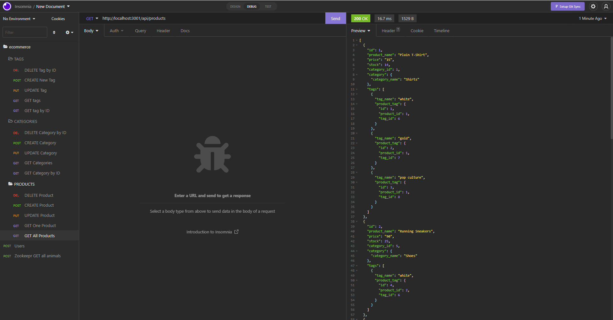

# Object-Relational Mapping (ORM) Challenge: E-commerce Back End
[](https://bootcamp.msu.edu/)


## Technologies


## Description
Developing and building the back end for an e-commerce site. The application will use an Express.js API and configured to use Sequelize to interact with the MySQL database. The application will be ran using the command line below: 
```
node start
```
## Installation
***Requirments***

[Node.js](https://nodejs.org/en/) | [MySQL](https://www.npmjs.com/package/mysql2) | [Sequelize](https://www.npmjs.com/package/sequelize) | [dotenv](https://www.npmjs.com/package/dotenv) | [Express](https://www.npmjs.com/package/express)

***Once Installed:***
1. Clone the Repository on to your machine.
2. Open the terminal and ensure you are in the right file path.
3. Run the command ```npm install``` to download the packages.
4. Log into my sequel and run the command ```source db/schema.sql``` to create the database.
5. Run the command ```npm run seed``` to seed the database.
6. Then run the command ```node start``` to run the software.
7. The application will then begin to run locally.

## User Story
```
AS A manager at an internet retail company
I WANT a back end for my e-commerce website that uses the latest technologies
SO THAT my company can compete with other e-commerce companies
```

## Acceptance Criteria
```
GIVEN a functional Express.js API
WHEN I add my database name, MySQL username, and MySQL password to an environment variable file
THEN I am able to connect to a database using Sequelize
WHEN I enter schema and seed commands
THEN a development database is created and is seeded with test data
WHEN I enter the command to invoke the application
THEN my server is started and the Sequelize models are synced to the MySQL database
WHEN I open API GET routes in Insomnia for categories, products, or tags
THEN the data for each of these routes is displayed in a formatted JSON
WHEN I test API POST, PUT, and DELETE routes in Insomnia
THEN I am able to successfully create, update, and delete data in my database
```

## Screenshot
The image below displays the database using the software Insomnia. In this case, we are using, 'GET', to recieve information from the database.


## Video
A link to the [Video Part 1](https://watch.screencastify.com/v/eB2igGHhc6KG4C9z3QdT). The video demonstrates on how to run the schema, seed the database, as well as start the server:
```
https://watch.screencastify.com/v/eB2igGHhc6KG4C9z3QdT
```

A link to the [Video Part 2](https://watch.screencastify.com/v/CeIjkqOH2JsQzYoTtQTo). The video demonstrates the POST, PUT, DELETE, and GET routes using the application, Insomnia.
```
https://watch.screencastify.com/v/CeIjkqOH2JsQzYoTtQTo
```

## Link
A link to the [code](https://github.com/jgarcia45/e-commerce-back-end):
```
https://github.com/jgarcia45/e-commerce-back-end
```

## License
  Copyright (c) Juan Garcia. All rights reserved.
  
  Licensed under the [MIT](LICENSE) license.